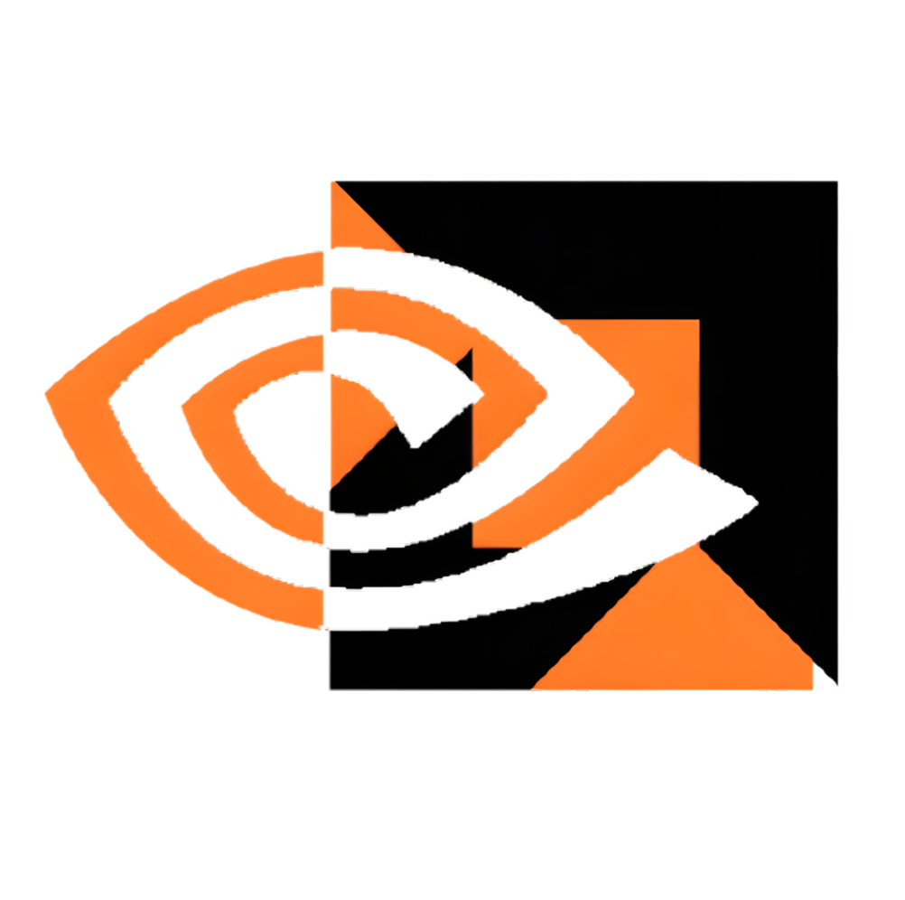
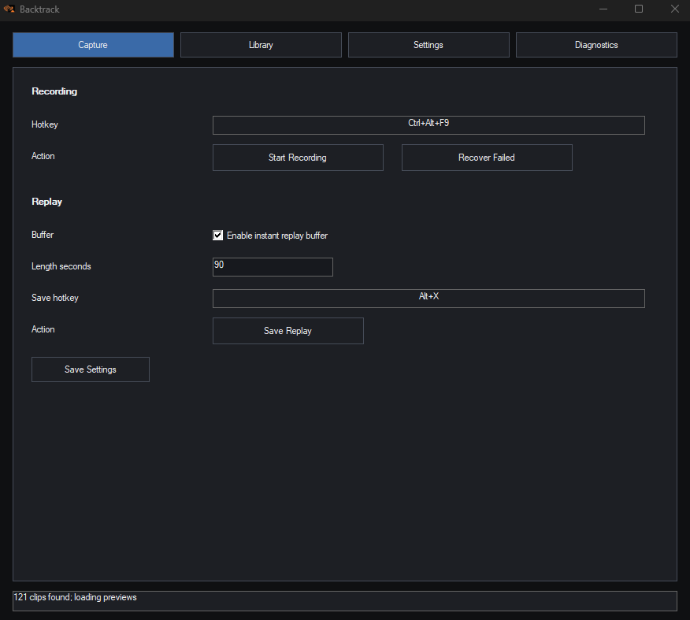

## backtrack
clipping software that works with both nvidia (nvenc) and amd (amf). on nvidia works without shadowplay.<br>
the goal was to create as lightweight clipping software as possible and i did some stuff but idk if i optimized the video encoding enough (~13% video encode with gtx 1060, 1080p60 and almost lowest gpu settings)



## why
i use nvidia and hate the bloat that comes with shadowplay, idk if works on a completely clean install but i used nvcleanstall with almost no dependencies and works purrfectly

## amd
i dont use amd, some features might not work. dont expect much

## FAQ
Q: how well does it work<br>
A: it works thankyou for the qeustion

## issues
i might fix or i might not fix. but feel free to report anything, i dont murder people.

## cool features
- customization of the gpu settigns
- multi-monitor support: the clip follows the focused monitor, pretty cool i'd say (can be turned off)
- library and you can drag out clips from it, it's cool, i recommend to change to gallery as its even more cool. you can favorite cool stuff which is pretty damn cool
- sound separation (you can disable spotify and other stuff
- cool icon that im proud of myself
- game integrations (only LoL works, and it only beeps. i amde it beacuse i forget to clip on kills)

## bad features
- "save log" button saves 55k lines and im not bothering to fix it sorry
- "follow mouse" doesnt work with the multi-montior (you must focus an app to record the specific monitor sorry)

## defaults

- Start/stop recording: `Ctrl+Alt+F9`
- Save replay: `Ctrl+Alt+F10`
- Clips: `%USERPROFILE%\Videos\Backtrack`
- Settings/logs: `%LOCALAPPDATA%\Backtrack`

## for anyone that actually cares about the "advanced" stuff (ai generated, im not writing allat myself):
## Features

- **GPU-first pipeline** - Direct3D 11 textures stay on the GPU through capture and encode. No CPU-side image conversion or readback in the capture path.
- **Dual capture backends** - Windows Graphics Capture (WGC) first, Desktop Duplication fallback, with automatic recovery on device/access loss.
- **Vendor-aware hardware encoding** - NVIDIA NVENC (NVIDIA Video Codec SDK) or AMD AMF (Advanced Media Framework), auto-selected by GPU vendor. NVENC registers BGRA textures directly; AMF consumes NV12 surfaces.
- **H.264 and HEVC** output, with configurable bitrate, FPS, GOP, and full encoder tuning (preset, mode, lookahead, spatial/temporal AQ, multipass, B-frames, reference frames).
- **Instant replay** - Encoded packets held in a ring buffer; save the last N seconds on a hotkey.
- **Audio capture** - WASAPI system loopback plus microphone, per-device selection and volume, with optional per-application sound separation (mute specific apps out of the mix).
- **Resolution scaling** - Native or fixed modes (240p through 4K) plus custom, scaled on the GPU.
- **Multi-monitor** - Pick a monitor, or follow the focused/mouse monitor.
- **GPU protection** - Adaptive frame-queue limits and idle-frame coalescing to prioritize game frame time.
- **League of Legends kill reminder** - Polls the local Live Client Data API and flags kills for a replay reminder.
- **Native MP4 muxing** via Windows Media Foundation.
- **Native Win32 UI** with Capture, Library, Settings, and Diagnostics pages, clip management (rename, delete, favorite, gallery/list views, thumbnails), configurable hotkeys, system tray, and start-with-Windows support.

## Repository Layout

```text
backtrack/src/app            Application and recorder orchestration, video timeline scheduler
backtrack/src/audio          WASAPI loopback and microphone capture
backtrack/src/capture        WGC, Desktop Duplication, D3D11 device setup, GPU frame scaler
backtrack/src/clips          Clip listing, rename, delete, favorite markers
backtrack/src/core           Shared types, logging, lock-free SPSC queue
backtrack/src/encoder        Encoder interface, NVENC + AMD AMF implementations, vendor auto-detect factory
backtrack/src/hotkeys        Global recording/replay hotkeys
backtrack/src/integrations   League of Legends Live Client Data polling
backtrack/src/mux            WAV writing and native MP4 muxing
backtrack/src/platform       Win32 utility helpers
backtrack/src/replay         Encoded packet replay ring buffer
backtrack/src/settings       Lightweight persisted settings
backtrack/src/ui             Native Windows UI
backtrack/src/Interface      NVENC headers and bundled AMD AMF headers
backtrack/tests              Video timeline scheduler unit tests
docs/architecture.md         Pipeline diagram and zero-copy notes
docs/gpu-optimization.md     GPU protection and adaptive queue notes
docs/profiling.md            Low-CPU profiling checklist
```

## Dependencies

Required:

- Windows 10/11 SDK
- Visual Studio C++ toolchain with C++20
- A hardware encoder: NVIDIA NVENC-capable GPU or AMD AMF-capable GPU (Radeon/Ryzen APU)

Encoder backend is auto-detected from the active GPU vendor at runtime:

- NVIDIA adapters use NVENC (`nvEncodeAPI64.dll`, shipped with the NVIDIA driver).
- AMD adapters use AMF (`amfrt64.dll`, shipped with the AMD Adrenalin driver).
- On other adapters the app tries NVENC first, then AMF.

Optional at compile time:

- NVENC headers (`Interface/nvEncodeAPI.h`, NVIDIA Video Codec SDK). If missing, NVENC is disabled at build time (`BACKTRACK_HAS_NVENC=0`).
- AMD AMF headers are bundled in `backtrack/src/Interface/AMF` (Apache/MIT, headers only), so AMF builds out of the box. Set `AMF_SDK_PATH` to point at a different copy if needed.
- If a backend's headers are absent, the app still builds and the Diagnostics page reports why that backend is unavailable. Neither SDK ships a link-time library; both runtimes are loaded dynamically from the installed driver.

## Build

Visual Studio solution:

```powershell
MSBuild.exe Backtrack.slnx /p:Configuration=Release /p:Platform=x64 /m
```

CMake:

```powershell
cmake -S . -B build -G "Visual Studio 18 2026" -A x64
cmake --build build --config Release --parallel
```

If the Video Codec SDK is not installed in a standard location, set:

```powershell
$env:NV_CODEC_SDK_PATH = 'C:\Path\To\Video_Codec_SDK'
```

The CMake Release executable is produced at:

```text
build/Release/Backtrack.exe
```

The Visual Studio project Release executable is produced at:

```text
x64/Release/backtrack.exe
```

## Tests

Unit tests for the video timeline scheduler live in `backtrack/tests/VideoTimelineSchedulerTests.cpp`. The scheduler is header-only (`app/VideoTimelineScheduler.h`), so the test compiles standalone:

```powershell
cl /std:c++20 /EHsc /I backtrack\src backtrack\tests\VideoTimelineSchedulerTests.cpp
.\VideoTimelineSchedulerTests.exe
```

The recording and replay hotkeys are configurable in Settings. The clip folder is configurable in the Capture settings. Audio devices, sound separation, resolution, encoder tuning, GPU protection, and game integrations are all configured in the Settings page.

## Notes

The active implementation uses Direct3D 11 because NVENC can directly register D3D11 textures. WGC and Desktop Duplication both output BGRA D3D11 textures, which are copied GPU-to-GPU into a small texture pool (or passed through directly when WGC zero-copy is enabled) before being registered/mapped by the encoder. A GPU scaler converts each frame to the active encoder's preferred format (BGRA for NVENC, NV12 for AMF). Only the compressed H.264/HEVC bitstream is copied back to CPU memory.

See `docs/architecture.md` for the full pipeline diagram, frame lifetime, and threading model.
