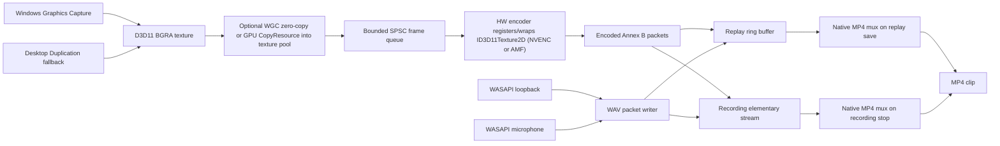

# AI GENERATED DOC
## Architecture

## Pipeline

## Frame Lifetime

1. Capture creates a D3D11 texture from Windows Graphics Capture or Desktop Duplication.
2. Windows Graphics Capture can pass the frame-pool texture directly downstream when WGC zero-copy is enabled. Desktop Duplication, and WGC when zero-copy is disabled, copy the frame with `ID3D11DeviceContext::CopyResource` into a reusable D3D11 texture pool so the OS-owned capture frame can be released quickly.
3. A GPU scaler converts the frame to the active encoder's preferred format (BGRA for NVENC, NV12 for AMF) and the capture thread pushes a `GpuFrame` containing `ID3D11Texture2D` into a lock-free single-producer/single-consumer queue.
4. The encode thread hands that texture to the active hardware encoder: NVENC registers it with `NV_ENC_INPUT_RESOURCE_TYPE_DIRECTX`; AMF wraps it with `AMFContext::CreateSurfaceFromDX11Native`.
5. The encoder reads the D3D texture directly. No CPU-side pixel buffer is created.
6. Only the compressed H.264/HEVC bitstream is copied back to CPU memory, which is unavoidable because it must be written to disk or retained for replay.

## Threading

- UI thread: native Win32 controls, hotkeys, clip manager.
- Capture thread: WGC/DXGI acquisition and GPU-to-GPU texture pool copy.
- Encode thread: hardware encoder submission (NVENC or AMF) and bitstream collection.
- WASAPI threads: event-driven loopback and microphone packet capture.

The hot path uses bounded queues and drops frames when the encoder falls behind rather than blocking capture. Adaptive GPU protection can lower the allowed backlog further to avoid encoder bursts and prioritize game frame time.

## Reliability

- WGC `Closed` and DXGI access-lost conditions mark capture as lost.
- The capture loop attempts to recreate the capture source after device/access loss.
- Monitor size changes recreate the WGC frame pool and texture pool.
- Shutdown stops recording, joins workers, stops WASAPI, drains the hardware encoder, and closes muxing files.

## Hardware Encoders

- `IEncoder` abstracts the hardware encoder. `createEncoder` (encoder/EncoderFactory) picks a backend from the D3D adapter vendor: NVIDIA -> `NvencEncoder` (NVENC), AMD -> `AmfEncoder` (AMF). Other vendors try NVENC then AMF.
- Both encoders share the D3D11 device with capture, so `ID3D11Texture2D` frames stay on the GPU. NVENC registers BGRA textures directly; AMF wraps them via `AMFContext::CreateSurfaceFromDX11Native`.
- Each backend advertises `preferredInputFormat()`. The capture scaler converts to that format before submission: BGRA for NVENC, NV12 for AMF AVC/HEVC.
- Keyframe detection, encoder-effective settings mapping, and per-backend capability queries follow the same pattern in both encoders. AMF preset/mode/AQ/B-frame knobs are mapped to the nearest AMF equivalents and clamped to queried caps.

## Current Integration Details

- WGC is attempted first by default.
- Desktop Duplication is the fallback backend.
- D3D11 is the active GPU API.
- Windows Media Foundation muxes MP4 output after recording/replay save. No external muxer process is launched.
- NVENC support is conditional on the NVIDIA Video Codec SDK headers at build time and `nvEncodeAPI64.dll` at runtime.
- AMF support uses bundled headers at build time and `amfrt64.dll` (AMD Adrenalin driver) at runtime.
